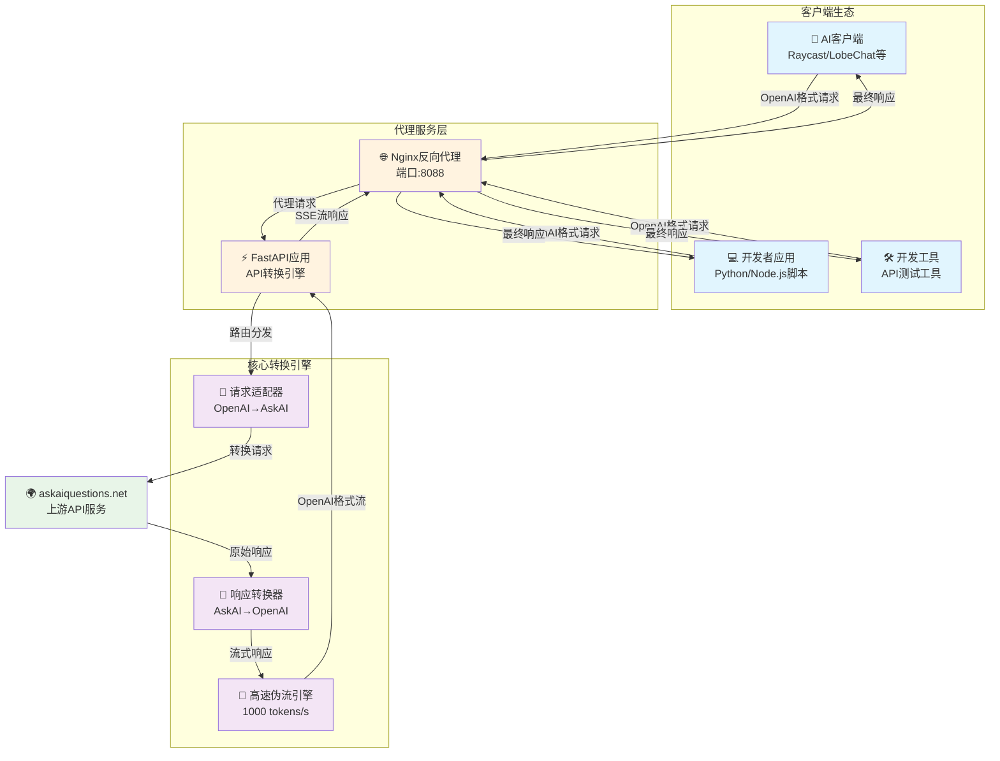
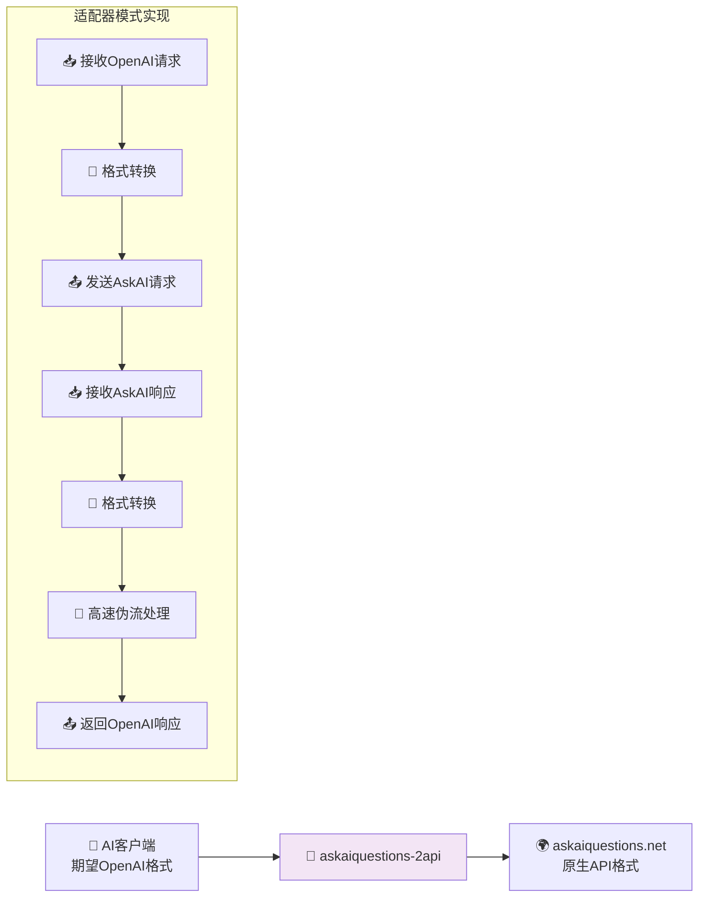
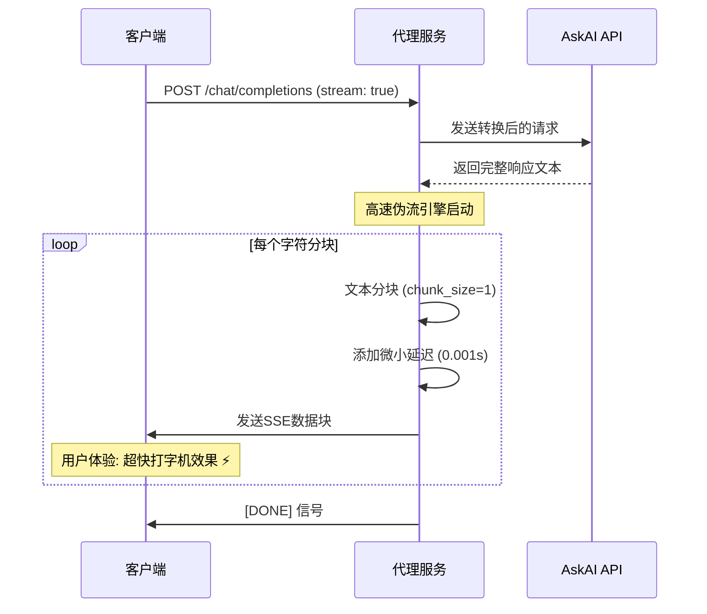
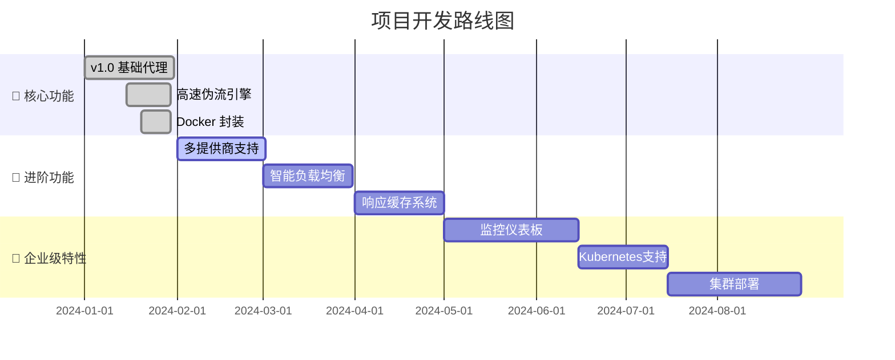

# askaiquestions-2api 🚀

<div align="center">

[](https://opensource.org/licenses/Apache-2.0)


[](https://github.com/lzA6/askaiquestions-2api)

**一个将 `askaiquestions.net` 转换为兼容 OpenAI 格式 API 的高性能代理服务**

**English** | **[中文](./README.md)**

</div>

---

> 🤔 **开发者独白：** 在代码的世界里，我们都是魔法师。我们不创造物质，但我们创造连接、效率和可能性。这个项目的诞生，源于一个简单的想法："如果一个好用的服务没有标准的'门'，我们为什么不为它建造一扇？" 这不仅仅是技术的转换，更是一种赋能。它赋予了老工具新的生命，赋予了开发者更多的选择。愿每一个敲击键盘的你，都能感受到创造的快乐，并坚信——我们正在让世界变得（哪怕只有一点点）更美好。

## ✨ 项目核心价值

`askaiquestions-2api` 不仅仅是一个工具，它更像一个"**思想转换器**"和"**机会创造者**"。

*   **它的作用是什么？** 核心作用是扮演一个"翻译官"。它将 `askaiquestions.net` 这个特定网站的 API 请求格式，实时"翻译"成全球开发者都非常熟悉的 OpenAI API 格式。
*   **它带来了什么好处？**
    - **无缝集成** 🤝：任何已经支持 OpenAI API 的应用、软件、脚本，现在都可以通过这个项目，瞬间拥有调用 `askaiquestions.net` 的能力，无需修改一行代码！
    - **生态复用** 🌳：你最爱的AI客户端、编程库、自动化工具，现在都能成为 `askaiquestions.net` 的用户界面。想象一下，你可以在 Raycast, ChatGPT-Next-Web, LobeChat 等无数优秀项目中直接使用它。
    - **超高感知性能** ⚡️：通过独特的"高速伪流"技术，即使原始接口一次性返回所有内容，我们也能模拟出 `1000 tokens/s` 的超快打字机效果，极大提升了流式交互的体验。
    - **便捷性与易用性** 🎈：我们把所有复杂性都封装在了 Docker 容器里。你只需要一个命令，就能在 1 分钟内拥有一个稳定、可靠、高性能的私人 API 服务。

## 🏗️ 系统架构



## 🚀 一键部署教程

### 📋 前置要求
- ✅ Docker & Docker-Compose
- ✅ 至少 512MB 可用内存
- ✅ 网络连接

### 🎯 快速开始

**第一步：克隆仓库**
```bash
git clone https://github.com/lzA6/askaiquestions-2api.git
cd askaiquestions-2api
```

**第二步：配置环境**
```bash
# 复制配置文件模板
cp .env.example .env

# 编辑配置文件（可选）
nano .env
```

**第三步：启动服务**
```bash
docker-compose up -d
```

**第四步：验证部署**
```bash
curl http://localhost:8088/v1/models -H "Authorization: Bearer 1"
```

🎉 **完成！服务已在后台运行**

### ⚙️ 配置说明

编辑 `.env` 文件来自定义配置：

```env
# API 安全配置
API_MASTER_KEY=your-secret-key-here  # 🔑 强烈建议修改！

# 服务端口配置
NGINX_PORT=8088                      # 🌐 对外服务端口

# 性能调优
STREAM_CHUNK_SIZE=1                  # ✂️ 流式响应分块大小
STREAM_DELAY=0.001                   # ⏱️ 流式延迟（秒）
```

## 🛠️ API 使用指南

### 🔌 连接配置

| 配置项 | 值 | 说明 |
|--------|-----|------|
| **API Base URL** | `http://localhost:8088/v1` | 服务地址 |
| **API Key** | `你的API_MASTER_KEY` | 认证密钥 |
| **模型名称** | `askai-default-model` | 模型标识 |

### 📝 请求示例

**示例1：标准非流式请求**
```bash
curl -X POST http://localhost:8088/v1/chat/completions \
  -H "Content-Type: application/json" \
  -H "Authorization: Bearer 1" \
  -d '{
    "model": "askai-default-model",
    "messages": [
      {
        "role": "user", 
        "content": "你好，请用一句话介绍你自己。"
      }
    ],
    "stream": false
  }'
```

**示例2：高速流式请求**  
体验超快的打字机效果！⚡
```bash
curl -X POST http://localhost:8088/v1/chat/completions \
  -H "Content-Type: application/json" \
  -H "Authorization: Bearer 1" \
  -d '{
    "model": "askai-default-model",
    "messages": [
      {
        "role": "user",
        "content": "请写一首关于宇宙的短诗"
      }
    ],
    "stream": true
  }'
```

**示例3：Python 客户端使用**
```python
import openai

client = openai.OpenAI(
    base_url="http://localhost:8088/v1",
    api_key="your-api-key"
)

response = client.chat.completions.create(
    model="askai-default-model",
    messages=[{"role": "user", "content": "Hello!"}],
    stream=True
)

for chunk in response:
    if chunk.choices[0].delta.content:
        print(chunk.choices[0].delta.content, end="", flush=True)
```

## 🧠 技术深度解析

### 🎯 核心设计模式



### ⚡ 高速伪流技术揭秘



**技术要点：**
- 🎯 **感知性能优化**：虽然上游一次性返回，但通过分块和延迟模拟真实流式体验
- ⚡ **极速响应**：1000 tokens/s 的视觉反馈速度
- 🔧 **可配置性**：分块大小和延迟时间可通过环境变量调整

## 📊 性能特性对比

| 特性 | 原生 AskAI API | 本代理服务 | 优势 |
|------|----------------|------------|------|
| **协议兼容性** | ❌ 自定义格式 | ✅ OpenAI 标准 | 🎯 生态无缝接入 |
| **流式响应** | ❌ 一次性返回 | ✅ 高速伪流 | ⚡ 极致用户体验 |
| **部署复杂度** | ❌ 直接调用 | ✅ Docker一键部署 | 🚀 分钟级上线 |
| **客户端支持** | ❌ 有限 | ✅ 所有OpenAI客户端 | 🌈 开箱即用 |
| **性能感知** | ⚠️ 等待时间长 | ✅ 即时反馈 | 💫 无焦虑等待 |

## 🔧 开发与扩展

### 🗂️ 项目结构

```
askaiquestions-2api/
├── 🐳 Docker 相关文件
│   ├── Dockerfile              # 应用容器构建
│   ├── docker-compose.yml      # 服务编排
│   └── nginx.conf              # 反向代理配置
├── 🐍 Python 应用代码
│   ├── main.py                 # FastAPI 主应用
│   ├── requirements.txt        # 依赖管理
│   └── app/
│       ├── core/               # 核心配置
│       │   └── config.py      # 配置管理
│       ├── providers/          # 服务提供商
│       │   ├── base_provider.py    # 抽象基类
│       │   └── askai_provider.py   # AskAI 实现
│       └── utils/              # 工具函数
│           └── sse_utils.py    # SSE 数据处理
├── 🔧 配置文件
│   ├── .env.example           # 环境变量模板
│   └── .env                   # 实际配置（生成）
└── 📚 文档
    └── README.md              # 项目文档
```

### 🎨 扩展新提供商

想要支持新的 AI 服务？只需3步：

1. **创建新的 Provider 类**：
```python
from app.providers.base_provider import BaseProvider

class NewAIProvider(BaseProvider):
    async def chat_completion(self, messages, stream=False):
        # 实现与新服务的通信逻辑
        pass
```

2. **实现请求响应转换**：
```python
def _convert_to_newai_format(self, messages):
    # 将OpenAI格式转换为新服务格式
    return newai_payload

def _convert_to_openai_format(self, newai_response):
    # 将新服务响应转换为OpenAI格式
    return openai_format_response
```

3. **注册到路由系统**：
```python
# 在 main.py 中添加路由逻辑
if model == "newai-model":
    provider = NewAIProvider()
```

## 🚀 性能优化指南

### ⚡ 流式响应优化

```nginx
# nginx.conf 关键配置
server {
    # 禁用代理缓冲，实现实时流式传输
    proxy_buffering off;
    
    # 设置超时时间
    proxy_read_timeout 300s;
    proxy_send_timeout 300s;
    
    # 启用分块传输编码
    chunked_transfer_encoding on;
}
```

### 🔧 应用层优化

```python
# 高速伪流核心参数
STREAM_CHUNK_SIZE = 1    # 分块大小：字符数
STREAM_DELAY = 0.001     # 延迟时间：秒

# 异步处理优化
async def _stream_generator(self, text):
    for i in range(0, len(text), self.chunk_size):
        chunk = text[i:i + self.chunk_size]
        yield self._create_sse_chunk(chunk)
        await asyncio.sleep(self.delay)
```

## 📈 监控与诊断

### 🔍 健康检查

```bash
# 检查服务状态
curl http://localhost:8088/health

# 检查模型列表
curl http://localhost:8088/v1/models -H "Authorization: Bearer your-key"

# 实时日志查看
docker-compose logs -f app
```

### 🐛 常见问题排查

| 问题 | 症状 | 解决方案 |
|------|------|----------|
| **连接被拒绝** | `Connection refused` | 检查端口占用和防火墙设置 |
| **认证失败** | `401 Unauthorized` | 验证 API Key 配置 |
| **流式中断** | 响应不完整 | 检查网络稳定性和超时设置 |
| **性能下降** | 响应缓慢 | 调整分块大小和延迟参数 |

## 🌟 未来发展规划

### 🗓️ 开发路线图



### 🎯 即将到来的特性

- **🔌 多上游支持**：同时接入多个 AI 服务提供商
- **⚖️ 智能负载均衡**：自动选择最优服务节点
- **💾 响应缓存**：Redis 支持，提升重复请求响应速度
- **📊 使用量统计**：详细的 Token 消耗和性能指标
- **🖥️ Web 管理界面**：图形化的服务管理和监控

## 🤝 贡献指南

我们欢迎各种形式的贡献！无论是代码、文档、创意还是问题反馈。

### 🎁 如何贡献

1. **Fork 本仓库**
2. **创建特性分支**：`git checkout -b feature/AmazingFeature`
3. **提交更改**：`git commit -m 'Add some AmazingFeature'`
4. **推送到分支**：`git push origin feature/AmazingFeature`
5. **提交 Pull Request**

### 📝 开发环境设置

```bash
# 1. 克隆仓库
git clone https://github.com/lzA6/askaiquestions-2api.git
cd askaiquestions-2api

# 2. 创建虚拟环境
python -m venv venv
source venv/bin/activate  # Linux/Mac
# venv\Scripts\activate  # Windows

# 3. 安装依赖
pip install -r requirements.txt

# 4. 设置环境变量
cp .env.example .env

# 5. 启动开发服务器
uvicorn main:app --reload --port 8000
```

### 🐛 提交问题

发现 Bug？有改进建议？请通过 [GitHub Issues](https://github.com/lzA6/askaiquestions-2api/issues) 提交，包括：

- 🐞 问题描述
- 🔍 重现步骤
- 💻 环境信息
- 📸 错误日志（如有）

## 🙏 致谢

感谢所有为这个项目做出贡献的开发者们！特别感谢：

- **FastAPI** 团队提供的优秀 Web 框架
- **Docker** 社区提供的容器化解决方案
- **OpenAI** 制定的 API 标准规范
- 所有**测试用户**和**问题反馈者**

---

<div align="center">

**如果这个项目对你有帮助，请给我们一个 ⭐ Star！**

Made with ❤️ and a lot of ☕ by the open source community.

[📖 文档](https://github.com/lzA6/askaiquestions-2api/wiki) | 
[🐛 问题反馈](https://github.com/lzA6/askaiquestions-2api/issues) | 
[💬 讨论](https://github.com/lzA6/askaiquestions-2api/discussions) | 
[🔧 贡献指南](CONTRIBUTING.md)

</div>
